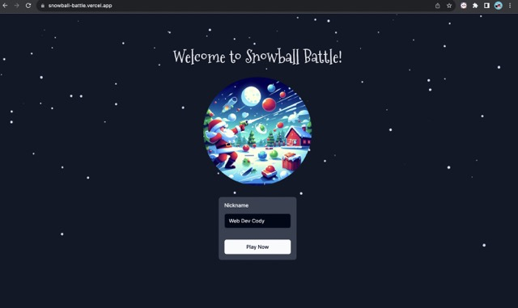
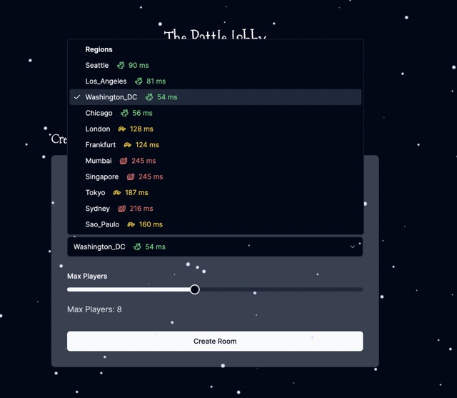

# Snowball Battle

Welcome to my Snowball Battle multiplayer game built using [hathora.dev](https://hathora.dev/?utm_source=webdevcody&utm_medium=banner&utm_campaign=2023).

You can try playing the deployed version of this application here:

https://snowball-battle.vercel.app/

This game is a snowball throwing arena game which includes the ability for user to create game lobbies across 11 different regions, support up to 16 players in a room, and scale without any effort using the Hathora game services for the game server.

### The start screen



### Multi-Region support



### Playing in a Room


## How to Run Locally

1. Clone the repo

```
Copy code
git@github.com:webdevcody/snowball-battle.git
```

2. Setup client and server:

```
# terminal 1
cd client
cp .env.sample .env
npm install

# terminal 2
cd server
cp .env.sample .env
npm install
```

3. Setup .env files

Setup a https://hathora.dev/ account and create an application. Copy your App Id and app secret from Hathora and place inside both client/.env and server/.env

4. Run client and server

```
# terminal 1 - client
npm run dev

# terminal 2 - server
npm run dev
```

5. Play game at http://localhost:3000

## Deploying

If you're like to deploy your own version, you'd need to either fork this repo and create a new repo and copy the code into your own repo. This code was deployed using vercel and github actions

### Deploying Client to Vercel

In order to deploy the client to vercel, you'll need to setup the following environment variables inside vercel:

```
NEXT_PUBLIC_HATHORA_APP_ID=YOUR_APP_ID
GOOGLE_CLIENT_ID=YOUR_GOOGLE_CLIENT_ID
GOOGLE_SECRET_KEY=YOUR_GOOGLE_CLIENT_SECRET
```

Create a vercel project and point it to the ./client sub directory. Your client will automatically deploy on each commit to main.

### Deploying using Github Actions

In order to have your server automatically deploy when pushing to github actions, you'll need to make sure you setup your github action environment variables:

```
HATHORA_TOKEN=YOUR_SECRET_APP_TOKEN
```
